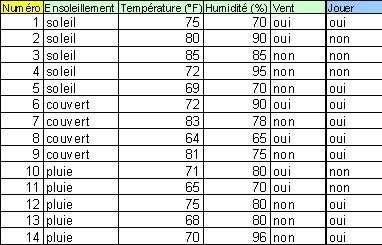

Intelligence Artificiel
===================================

###Arbres de décision et IA

Exemple de Quinlan (C4.5, 1993)

Soit: 
p : Proposition
N(p) le cardinal des exemples associés à p.
N(k/p) : le cardinal des exemples de classe k associés a p
P(k/p) : la proportion d'élément

Exemple : 
N(Soleil T>65 H>65 pas de vent) = 3
N(Joue/Soleil T>65 H>65 pas de vent) = 1
P(Joue/Soleil T>65 H>65 pas de vent) = 1/3

9 jouent, 5 ne jouent pas. En regardant d'après :

L'ensoleillement : (2.3) (4.0) (3.2)
Le vent : (3.3) (6.2)
La température : Problème : c'est continu.
L'humidité : Problème : c'est continu.

Fonctions d'évaluation de la discrimination.
C4.5 utilise la notion d'entropie (évaluation du mélange des classes)
Si une variable v ne discrimine rien, il y a autant de joueurs qui jouent si elle est vraie que si elle n'est pas vraie.

Quelle est la valeur discriminante du vente ?
Pouvoir discriminant = entropie max - entropie de la variable (normalisation de l'entropie)
Le pouvoir discriminant de l'ensoleillement est et le pouvoir discriminant du 